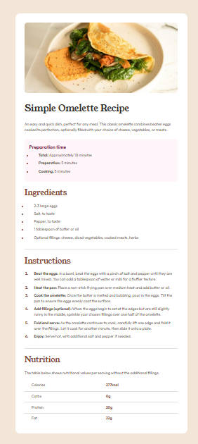

# Frontend Mentor - Recipe page solution

This is a solution to the [Recipe page challenge on Frontend Mentor](https://www.frontendmentor.io/challenges/recipe-page-KiTsR8QQKm). Frontend Mentor challenges help you improve your coding skills by building realistic projects.

## 目录

- [预览](#预览)
  - [截图](#截图)

## 预览

### 截图



## 我的进程

### 构建方式

- HTML5 编写静态页面
- CSS 编写属性
- 修改 ul,ol 的项目符号与字体的间距
- 媒体查询改变容器高宽度

### 我学习到了什么

1、ul,ol 项目符号与 li 文字的间距，`::marker`调整项目符号的样式;

```css
/* ul ol 列表符号原本就超出容器显示 */
ul,
ol {
  padding-left: 20px; /* 调整符号与左侧边界的距离 */
}

li {
  padding-left: 20px; /* 调整文本与符号的间距 */
  margin-bottom: 10px;
}

/* 调整项目符号的样式, 适配性比较差 */
li::marker {
  color: var(--Brown-800);
  font-weight: 700;
}
```
